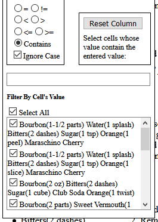
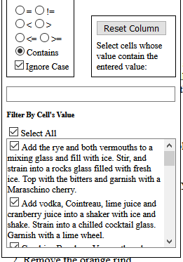
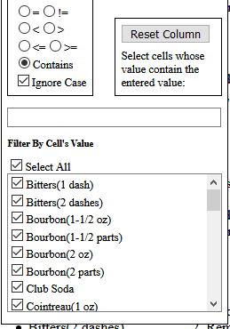
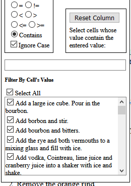

# Changing Cell Interpretation

<a name="defaultProcessing"></a>By default, HTMLTableWrapper.js only considers the `textContent` of each cell. 
When dealing with cells of specialized format, a [`CellInterpreter`][CellInterpreter] can be used.

Consider a drink recipe aggregator. A table on such a website would have a column detailing each drink's 
list of ingredients, and another listing steps to combine them:
``` html
<!-- ... -->
<table id="drinks">
    <thead>
        <tr>
            <th>Drink</th>
            <th>Source</th>
            <th>Ingredients</th>
            <th>Instructions</th>
        </tr>
    </thead>
    <tbody>
        <tr>
            <td>Manhattan (Traditional)</td>
            <td><a href="https://www.makersmark.com/cocktails/makers-46-manhattan">Maker's Mark</a></td>
            <td>
                <ul>
                    <li>Bourbon(2 parts)</li>
                    <li>Sweet Vermouth(1 part)</li>
                    <li>Bitters(2 dashes)</li>
                    <li>Maraschino Cherry</li>
                </ul>
            </td>
            <td>
                <ol>
                    <li>Combine Bourbon, Vermouth and Bitters in a mixing glass</li>
                    <li>Stir and strain into a chilled cocktail glass neat, or on the rocks</li>
                    <li>Garnish with cherry</li>
                </ol>
            </td>
        </tr>
        <tr>
            <td>Manhattan (Traditional)</td>
            <td><a href="https://www.allrecipes.com/recipe/222415/manhattan-cocktail">Allrecipes</a></td>
            <td>
                <ul>
                    <li>Rye(2 oz)</li>
                    <li>Sweet Vermouth(1/2 oz)</li>
<!-- ... -->
```

Without special instruction, the "Ingredients" and "Instructions" columns don't show meaningful values:

 

A [`CellInterpreter`][CellInterpreter] can be used to tell HTMLTableWrapper.js to split these cells
by the individual items they list.


## API Explanation

[`CellInterpreter`][CellInterpreter]s can be given as either standalone JavaScript functions, or as objects
having a function property called [`populateCellValues`][CellInterpreter-populateCellValues]. In either case,
it must have this signature:

`boolean (HTMLTableCellElement cell, `[`ColumnValueSet`][ColumnValueSet]` values)`

The [function][HTMLTableWrapperControl~populateCellValues] should add all the values contained in `cell` to
the given `values`. If `cell` is not in a recognized format, return `true` to defer to 
[default](#defaultProcessing) processing.


## Implementation

For our purposes, a standalone function can be used:
``` javascript
function interpretListCell(cell, values) {
    'use strict';
    
    var listElements, i;
    
    listElements = cell.getElementsByTagName('li');
    
    // If cell contains no list elements, defer to the default processing.
    if (!listElements.length) {
        return true;
    }
    
    // Otherwise, add the textContent of each list element to the given set of values.
    for (i = 0; i < listElements.length; ++i) {
        values.add(listElements[i].textContent);
    }
    
    // Not strictly necessary; permissable to not have a return value.
    // (No return statement implies a return value of undefined, which evaluates to false.)
    return false;
}
```

In order for a [`CellInterpreter`][CellInterpreter] to be used, it must be passed to a relevant
[`HTMLTableWrapperListener`][HTMLTableWrapperListener]. Note, [`CellInterpreter`][CellInterpreter]s must
be passed as the third argument. The second argument is a [`ColumnControlFactory`][ColumnControlFactory], and
is covered in the [next example][next-example].
```html
<link rel="stylesheet" href="https://cdn.jsdelivr.net/npm/html-table-wrapper/html-table-wrapper.min.css" />
<script src="https://cdn.jsdelivr.net/npm/html-table-wrapper/html-table-wrapper.min.js"></script>

<script src="list-cell-interpreter-fn.js"></script>
<script>
document.addEventListener('DOMContentLoaded', function () {
    'use strict';
    
    // CellInterpreters must be passed as the third argument.
    // The second argument is a ColumnControlFactory, which is covered in the next example.
    new HTMLTableWrapperListener(document.getElementById('drinks'), null, interpretListCell).init();
});
</script>
```

This results in more meaningful output:

 

The working webpage can be found [here](https://mschlege1838.github.io/html-table-wrapper/examples/drinks/drinks.html).


[CellInterpreter]: https://mschlege1838.github.io/html-table-wrapper/CellInterpreter.html
[CellInterpreter-populateCellValues]: https://mschlege1838.github.io/html-table-wrapper/CellInterpreter.html#populateCellValues
[ColumnValueSet]: https://mschlege1838.github.io/html-table-wrapper/ColumnValueSet.html
[HTMLTableWrapperListener]: https://mschlege1838.github.io/html-table-wrapper/HTMLTableWrapperListener.html
[ColumnControlFactory]: https://mschlege1838.github.io/html-table-wrapper/ColumnControlFactory.html
[HTMLTableWrapperControl~populateCellValues]: https://mschlege1838.github.io/html-table-wrapper/HTMLTableWrapperControl.html#~populateCellValues

[next-example]: https://github.com/mschlege1838/html-table-wrapper/tree/master/examples/temperatures
