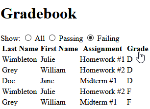

# Using [`HTMLTableWrapper`][HTMLTableWrapper] Directly

All examples prior to this made use of the [_full_][configuration-full] HTMLTableWrapper.js libarary through
[`HTMLTableWrapperListener`][HTMLTableWrapperListener] and some form of [`ColumnControl`][ColumnControl].
This example uses HTMLTableWrapper.js' core class definition directly: 
[`HTMLTableWrapper`][HTMLTableWrapper].

Consider the [gradebook][gradebook-example] from earlier, but with a more specialized interface. We define
option buttons enabling the table to be filtered down to grades that are only passing or failing:
``` html
<body>
    <h1>Gradebook</h1>
    <div>
        <span>Show:</span>
        <span>
            <input id="gradeCategoryAll" class="grade-category" type="radio" name="gradeCategory" 
                    value="all" checked />
            <label for="gradeCategoryAll">All</label>
        </span>
        <span>
            <input id="gradeCategoryPassing" class="grade-category" type="radio" name="gradeCategory" 
                    value="passing" />
            <label for="gradeCategoryPassing">Passing</label>
        </span>
        <span>
            <input id="gradeCategoryFailing" class="grade-category" type="radio" name="gradeCategory" 
                    value="failing" />
            <label for="gradeCategoryFailing">Failing</label>
        </span>
    </div>
    <table id="grades">
        <thead>
            <tr>
                <th>Last Name</th>
                <th>First Name</th>
                <th>Assignment</th>
                <th>Grade</th>
            </tr>
<!-- ... -->
```

We'll also enable sorting by clicking on column headers:




## API Explanation

Communication with [`HTMLTableWrapper`][HTMLTableWrapper] is facilitated through the callback interfaces
[`FilterDescriptor`][FilterDescriptor] and [`SortDescriptor`][SortDescriptor]. These are covered in detail in
the next [example][next-example].

This example uses the [_utility_][configuration-utility] implementations of these interfaces:

- [`SimpleFilterDescriptor`][SimpleFilterDescriptor]

   The general-purpose implementation of [`FilterDescriptor`][FilterDescriptor]. Its constructor has the signature:
   
   **`constructor`** `(number columnIndex, [any] compareValue, string operator='=', number columnType?)`
   
   It instructs [`HTMLTableWrapper`][HTMLTableWrapper] to filter the column `columnIndex` against `compareValue` 
   using `operator`. `Operator` is a `string` representing  the typical mathematical operators (`=`, 
   `<`, `>`, `<=`, `>=`), or the not-so-typical string operators:
   
   - `~` : contains
   - `~~`  : contains, ignore case
   
   E.g. to [`filter`][HTMLTableWrapper-filter] column index `3` to values less than `2`, use
   
   ``` javascript
   htmlTableWrapper.filter(new SimpleFilterDescriptor(3, 2, '<'));
   ```
   
   See the [documentation][HTMLTableWrapperUtils-COLUMN_TYPE_TEXT] for details on `columnType`.
   
- [`SimpleSortDescriptor`][SimpleSortDescriptor]

    The general-purpose implementation of [`SortDescriptor`][SortDescriptor]. Its constructor has the signature:
    
    **`constructor`**` (number columnIndex, boolean descending=false)`

    It instructs [`HTMLTableWrapper`][HTMLTableWrapper] to sort the column `columnIndex` in ascending or
    descending order.
    
    E.g. to sort column index `3` in ascending order, use
    
    ``` javascript
    htmlTableWrapper.sort(new SimpleSortDescriptor(3));
    ```

    Or, to sort in descending order, use
    
    ``` javascript
    htmlTableWrapper.sort(new SimpleSortDescriptor(3, true));
    ```


## Implementation

We define [`GradeCategoryListener`](GradeCategoryListener.js) to handle filtering. Itd constructor takes an 
[`HTMLTableWrapper`][HTMLTableWrapper], the index of the column containing grades, and the option buttons 
corresponding to grade categories:
``` javascript
function GradeCategoryListener(htmlTableWrapper, gradeColumnIndex, gradeCategoryInputs) {
    'use strict';
    
    this.htmlTableWrapper = htmlTableWrapper;
    this.gradeColumnIndex = gradeColumnIndex;
    this.gradeCategoryInputs = gradeCategoryInputs;
}

GradeCategoryListener.PASSING_CATEGORY_NAME = 'passing';
GradeCategoryListener.FAILING_CATEGORY_NAME = 'failing';
GradeCategoryListener.ALL_CATEGORIES_NAME = 'all';

GradeCategoryListener.prototype.init = function () {
    'use strict';
    
    var gradeCategoryInputs, i;
    
    gradeCategoryInputs = this.gradeCategoryInputs;
    for (i = 0; i < gradeCategoryInputs.length; ++i) {
        gradeCategoryInputs[i].addEventListener('click', this, false);
    }
};

GradeCategoryListener.prototype.dispose = function () {
    'use strict';
    
    var gradeCategoryInputs, i;
    
    gradeCategoryInputs = this.gradeCategoryInputs;
    for (i = 0; i < gradeCategoryInputs.length; ++i) {
        gradeCategoryInputs[i].removeEventListener('click', this, false);
    }
};
```

The `filterByCategory` function calls [`HTMLTableWrapper.filter`][HTMLTableWrapper-filter] with an appropriate
[`SimpleFilterDescriptor`][SimpleFilterDescriptor] based upon a given `category`:
``` javascript
GradeCategoryListener.prototype.filterByCategory = function (category) {
    'use strict';
    
    var htmlTableWrapper, gradeColumnIndex;
    
    htmlTableWrapper = this.htmlTableWrapper;
    gradeColumnIndex = this.gradeColumnIndex;
    
    switch (category) {
        case GradeCategoryListener.PASSING_CATEGORY_NAME:
            // Passing => filter to grades that are 'C', or occur before it in the alphabet:
            htmlTableWrapper.filter(new SimpleFilterDescriptor(gradeColumnIndex, 'C', '<='));
            break;
            
        case GradeCategoryListener.FAILING_CATEGORY_NAME:
            // Failing => filter to grades that occur after 'C' in the alphabet:
            htmlTableWrapper.filter(new SimpleFilterDescriptor(gradeColumnIndex, 'C', '>'));
            break;
            
        case GradeCategoryListener.ALL_CATEGORIES_NAME:
        default:
            // Otherwise, show all grades:
            htmlTableWrapper.clearFilter();
            break;
    }

};
```

With `filterByCategory`, the `handleEvent` function is trivial:
``` javascript
GradeCategoryListener.prototype.handleEvent = function (event) {
    'use strict';
    
    this.filterByCategory(event.target.value);
};
```

Next, we define [`ClickSortListener`](ClickSortListener.js) to handle sorting. Its constructor takes a single 
[`HTMLTableWrapper`][HTMLTableWrapper], and uses [`getTableElement`][HTMLTableWrapper-getTableElement] to 
access its backing table. It adds itself as a click listener on the first row of table headers, and stores 
them directly for subsequent access:
``` javascript
function ClickSortListener(htmlTableWrapper) {
    'use strict';
    
    this.htmlTableWrapper = htmlTableWrapper;
}

ClickSortListener.ASCENDING_SORT_CLASS_NAME = 'ascending';
ClickSortListener.DESCENDING_SORT_CLASS_NAME = 'descending';

ClickSortListener.prototype.init = function () {
    'use strict';
    
    var tableHeaderCache, tableHeaders, i, tableHeader;
    
    tableHeaderCache = this.tableHeaderCache = [];
    tableHeaders = this.htmlTableWrapper.getTableElement().tHead.rows[0].cells;
    for (i = 0; i < tableHeaders.length; ++i) {
        tableHeader = tableHeaders[i];
        tableHeader.addEventListener('click', this, false);
        tableHeaderCache.push(tableHeader);
    }
};

ClickSortListener.prototype.dispose = function () {
    'use strict';
    
    var tableHeaderCache, i;
    
    tableHeaderCache = this.tableHeaderCache;
    for (i = 0; i < tableHeaderCache.length; ++i) {
        tableHeaderCache[i].removeEventListener('click', this, false);
    }
    
    this.tableHeaderCache = null;
};
```

In `handleEvent`, we use the `classList` of the clicked column header to decide how to sort. We rotate between
the sort orders: ascending, descending, and none, and call [`HTMLTableWrapper.sort`][HTMLTableWrapper-sort] with
an appropriate [`SimpleSortDescriptor`][SimpleSortDescriptor]. If the clicked column header is different than the 
previously clicked column header, we clear the state of the previous column.
``` javascript
ClickSortListener.prototype.lastColumnIndex = -1;

ClickSortListener.prototype.handleEvent = function (event) {
    'use strict';
    
    var header, headerClassList, columnIndex, htmlTableWrapper, lastColumnIndex, tableHeaderCache;
    
    // Setup.
    htmlTableWrapper = this.htmlTableWrapper;
    tableHeaderCache = this.tableHeaderCache;
    header = event.target;
    
    // Error conditions.
    columnIndex = tableHeaderCache.indexOf(header);
    if (columnIndex === -1) {
        console.warn('Unrecognized column.');
        return;
    }
    
    // Clear last sorted column.
    lastColumnIndex = this.lastColumnIndex;
    if (lastColumnIndex !== -1 && columnIndex !== lastColumnIndex) {
        headerClassList = tableHeaderCache[lastColumnIndex].classList;
        headerClassList.remove(ClickSortListener.ASCENDING_SORT_CLASS_NAME);
        headerClassList.remove(ClickSortListener.DESCENDING_SORT_CLASS_NAME);
    }
    this.lastColumnIndex = columnIndex;
    
    // Sort requested column.
    headerClassList = header.classList;
    
    // Currently sorted in ascending order => switch to descending.
    if (headerClassList.contains(ClickSortListener.ASCENDING_SORT_CLASS_NAME)) {
        headerClassList.remove(ClickSortListener.ASCENDING_SORT_CLASS_NAME);
        headerClassList.add(ClickSortListener.DESCENDING_SORT_CLASS_NAME);
        
        htmlTableWrapper.sort(new SimpleSortDescriptor(columnIndex, true));
    } 
    // Currently sorted in descending order => clear sorting.
    else if (headerClassList.contains(ClickSortListener.DESCENDING_SORT_CLASS_NAME)) {
        headerClassList.remove(ClickSortListener.DESCENDING_SORT_CLASS_NAME);
        
        htmlTableWrapper.clearSort();
    } 
    // Currently not sorted => switch to ascending.
    else {
        headerClassList.add(ClickSortListener.ASCENDING_SORT_CLASS_NAME);
        
        htmlTableWrapper.sort(new SimpleSortDescriptor(columnIndex, false));
    }
};
```

Page initialization looks like this:
``` html
<link rel="stylesheet" href="https://cdn.jsdelivr.net/npm/html-table-wrapper/html-table-wrapper-util.min.css" />
<style>
th {
    cursor: pointer;
}
</style>

<script src="https://cdn.jsdelivr.net/npm/html-table-wrapper/html-table-wrapper-util.min.js"></script>
<script src="ClickSortListener.js"></script>
<script src="GradeCategoryListener.js"></script>
<script>

document.addEventListener('DOMContentLoaded', function () {
    'use strict';
    
    var tableWrapper, gradeCategoryInputs;
    
    tableWrapper = new HTMLTableWrapper(document.getElementById('grades'));
    gradeCategoryInputs = document.getElementsByClassName('grade-category');
    
    new ClickSortListener(tableWrapper).init();
    new GradeCategoryListener(tableWrapper, 3, gradeCategoryInputs).init();
});

</script>
```

The working webpage can be found [here](https://mschlege1838.github.io/html-table-wrapper/examples/gradebook-minimal/gradebook-minimal.html).


[SimpleSortDescriptor]: https://mschlege1838.github.io/html-table-wrapper/SimpleSortDescriptor.html
[SimpleFilterDescriptor]: https://mschlege1838.github.io/html-table-wrapper/SimpleFilterDescriptor.html
[FilterDescriptor]: https://mschlege1838.github.io/html-table-wrapper/FilterDescriptor.html
[HTMLTableWrapper]: https://mschlege1838.github.io/html-table-wrapper/HTMLTableWrapper.html
[HTMLTableWrapper-sort]: https://mschlege1838.github.io/html-table-wrapper/HTMLTableWrapper.html#sort
[HTMLTableWrapper-filter]: https://mschlege1838.github.io/html-table-wrapper/HTMLTableWrapper.html#filter
[HTMLTableWrapper-getTableElement]: https://mschlege1838.github.io/html-table-wrapper/HTMLTableWrapper.html#getTableElement
[SimpleSortDescriptor]: https://mschlege1838.github.io/html-table-wrapper/SimpleSortDescriptor.html
[SortDescriptor]: https://mschlege1838.github.io/html-table-wrapper/SortDescriptor.html
[HTMLTableWrapperListener]: https://mschlege1838.github.io/html-table-wrapper/HTMLTableWrapperListener.html
[ColumnControl]: https://mschlege1838.github.io/html-table-wrapper/ColumnControl.html
[HTMLTableWrapperUtils-COLUMN_TYPE_TEXT]: https://mschlege1838.github.io/html-table-wrapper/HTMLTableWrapperUtils#COLUMN_TYPE_TEXT

[configuration-full]: https://github.com/mschlege1838/html-table-wrapper#configurationFull
[configuration-utility]: https://github.com/mschlege1838/html-table-wrapper#configurationUtility
[gradebook-example]: https://github.com/mschlege1838/html-table-wrapper/tree/master/examples/gradebook
[next-example]: https://github.com/mschlege1838/html-table-wrapper/tree/master/examples/temperatures-custom
