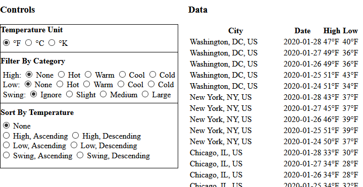

# Programming For [`HTMLTableWrapper`][HTMLTableWrapper]

HTMLTableWrapper.js' [_full_][configuration-full] and [_utility_][configuration-utility] libraries ship with
classes that streamline its use, but they are not required. This example uses the [_core_][configuration-core]
library, and walks through programming for and interacting directly with [`HTMLTableWrapper`][HTMLTableWrapper].

Consider the [temperatures][temperatures-example] example from before, but with a category-based filtering and 
sorting interface:



The 'Temperature Unit' option buttons have their `value` set to the unit they represent:
``` html
<h4>Temperature Unit</h4>
<span>
    <input id="temperatureUnitFahrenheit" class="temperature-unit"  type="radio" 
            name="temperatureUnit" value="F" checked />
    <label for="temperatureUnitFahrenheit" class="fahrenheit" title="Fahrenheit"></label>
</span>
<span>
    <input id="temperatureUnitCelsius" class="temperature-unit" type="radio" 
            name="temperatureUnit" value="C" />
    <label for="temperatureUnitCelsius" class="celsius" title="Celsius"></label>
</span>
<!-- ... -->
```

The 'Filter By Category' option buttons define temperature ranges. Their `data-orig-gt` and `data-orig-lte`
attributes set up the inequality:

> `data-orig-gt < T <= data-orig-lte`, where `T` is a given temperature.

As in the previous [example][temperatures-example], the `data-orig-unit` attribute indicates the original 
unit in which the range is specified. The category of the option button is stored in its `class`:
``` html
<span>High:</span>
<span>
    <input id="temperatureCategoryHighNone" class="temperature-category high" type="radio" 
            name="temperatureCategoryHigh" value="none" checked />
    <label for="temperatureCategoryHighNone">None</label>
</span>
<span>
    <input id="temperatureCategoryHighHot" class="temperature-category high" type="radio" 
            name="temperatureCategoryHigh" value="hot" data-orig-unit="F" data-orig-gt="75" />
    <label for="temperatureCategoryHighHot">Hot</label>
</span>
<!-- ... -->
```

The `data-orig-*` attributes are used in performing temperature conversions to avoid data loss.

The 'Sort By Temperature' option buttons define their category through the `data-category` attribute and sort
direction through their `value`:
``` html
<span>
    <input id="temperatureSortHighAscending" class="temperature-sort" type="radio" 
            name="temperatureSort" data-category="high" value="asc" />
    <label for="temperatureSortHighAscending">High, Ascending</label>
</span>
<span>
    <input id="temperatureSortHighDescending" class="temperature-sort" type="radio" 
            name="temperatureSort" data-category="high" value="desc" />
    <label for="temperatureSortHighDescending">High, Descending</label>
</span>
<!-- ... -->
```

## API Explanation

The [`HTMLTableWrapper.filter`][HTMLTableWrapper-filter] function is called with one or more
[`FilterDescriptor`][FilterDescriptor]s.

A [`FilterDescriptor`][FilterDescriptor] is a callback interface describing the values to be included after
[`filter`][HTMLTableWrapper-filter] is called. If it defines a `columnIndex` property, it is column-based. If
not, it is row-based. Its implementation is as follows:
- `get` [`columnIndex`][FilterDescriptor-columnIndex]: Optional zero-based index of the target column. If it
   is not a positive number, the [`FilterDescriptor`][FilterDescriptor] is row-based.
- `function` [`include`][FilterDescriptor-include]: Called by [`filter`][HTMLTableWrapper-filter] for each
  row in the table to see whether it should be included. Returning `true` indicates the row should be included.
  Returning `false` will result in it being filtered. If the [`FilterDescriptor`][FilterDescriptor] is
  column-based, it will be passed the target `HTMLTableCellElement` for each row. Otherwise, it will be
  passed the `HTMLTableRowElement`, itself.


The [`HTMLTableWrapper.sort`][HTMLTableWrapper-sort] function is called with one or more 
[`SortDescriptor`][SortDescriptor]s.

A [`SortDescriptor`][SortDescriptor] is a callback interface describing how values in the table compare to
one another. If it defines a `columnIndex` property, it is column-based. If not, it is row-based. Its 
implementation is as follows:
- `get` [`columnIndex`][SortDescriptor-columnIndex]: Optional zero-based index of the target column. If it
   is not a positive number, the [`SortDescriptor`][SortDescriptor] is row-based.
- `function` [`compare`][SortDescriptor-compare]: Called by [`sort`][HTMLTableWrapper-sort] to compare two
  rows to each other. Returning a value less than `0` indicates the first row should be sorted above the second.
  Returning a value greater than `0` indicates the first should be sorted below the second. Returning `0`
  indicates no preference. If the [`SortDescriptor`][SortDescriptor] is column-based, it will be passed the
  target `HTMLTableCellElement`s of each row. Otheriwse, it will be passed the `HTMLTableRowElement`s,
  themselves.


## Notes

This example includes supporting objects/classes that are not directly related to HTMLTableWrapper.js. They
are briefly explained here. Consult their source files for details.

- [`conversions.js`](conversions.js)

   Defines direct temperature-to-temperature and unit-to-unit conversions. Builds these into a lookup 
   dictionary object.

- [`TemperatureConversionListener`](TemperatureConversionListener.js)

   Converts temperature-related data in response to click events on the 'Temperature Unit' option buttons.
   As in the previous [example][temperatures-example], temperature-related columns in the table are
   converted based on thier `data-orig-unit` and `data-orig-temp` attributes. The 'Filter By Category'
   option buttons have their `data-current-gt` and `data-current-lte` attributes set based on the converted
   values of their `data-orig-gt` and `data-orig-lte` attributes. The `data-current-*` attributes are used 
   for subsequent processing.

## Implementation

We perform sorting and filtering based on high &amp; low temperatures and the difference between them (swing).
The [`Filter`][FilterDescriptor] and [`SortDescriptor`][SortDescriptor]s handling high and low temperatures 
will be column-based, but those handling the swing will be row-based.

We start by defining [`FilterDescriptor`][FilterDescriptor]s.

<a name="highLowFilter"></a>
The [`FilterDescriptor`][FilterDescriptor] for high and low temperatures is [`HighLowFilter`](HighLowFilter.js).
The arguments to its constructor are the target `columnIndex` and the low and high bounds of the temperature 
range it represents: `gtRange` and `ltRange`:
``` javascript
function HighLowFilter(columnIndex, gtRange, lteRange) {
    'use strict';
    
    this.columnIndex = columnIndex;
    this.gtRange = gtRange;
    this.lteRange = lteRange;
}
```

Its [`include`][FilterDescriptor-include] function tests whether or not a given `cell`'s value is within the
required range. If nothing is `NaN`, and the `cell`'s value falls within the required range, the function 
returns `true`, otherwise `false`:
``` javascript
HighLowFilter.prototype.include = function (cell) {
    'use strict';
    
    var gtRange, lteRange, currentValue;
    
    // Parse current value.
    currentValue = Number.parseFloat(cell.textContent);
    if (Number.isNaN(currentValue)) {
        // Always filter NaNs
        return false;
    }
    
    gtRange = this.gtRange;
    lteRange = this.lteRange;
    
    // If the current value is not greater than the lower bound of the range, filter.
    if (!Number.isNaN(gtRange) && !(currentValue > gtRange)) {
        return false;
    }
    // If the current value is not less than or equal to the upper bound of the range, filter.
    if (!Number.isNaN(lteRange) && !(currentValue <= lteRange)) {
        return false;
    }
    
    // Otheriwse, include.
    return true;
};
```

<a name="swingFilter"></a>
The [`FilterDescriptor`][FilterDescriptor] for temperature swings is [`SwingFilter`](SwingFilter.js). The 
arguments to its constructor are the high and low bounds of the temperature range it represents (like 
[`HighLowFilter`](#highLowFilter)), and the index of the high and low temperature columns:
``` javascript
function SwingFilter(gtRange, lteRange, highColumnIndex, lowColumnIndex) {
    'use strict';
    
    this.gtRange = gtRange;
    this.lteRange = lteRange;
    this.highColumnIndex = highColumnIndex;
    this.lowColumnIndex = lowColumnIndex;
}
```

Its [`include`][FilterDescriptor-include] function calculates the difference between the high &amp; low
columns. If nothing is `NaN`, and the difference is within the required range, the function returns `true`,
otherwise `false`:
``` javascript
SwingFilter.prototype.include = function (row) {
    'use strict';
    
    var cells, currentSwing, gtRange, lteRange;
    
    cells = row.cells;
    
    // Calculate difference between the high and low (swing).
    currentSwing = Number.parseFloat(cells[this.highColumnIndex].textContent) 
            - Number.parseFloat(cells[this.lowColumnIndex].textContent)
    if (Number.isNaN(currentSwing)) {
        // Always filter NaNs.
        return false;
    }
    
    gtRange = this.gtRange;
    lteRange = this.lteRange;
    
    // If the current swing is not greater than the lower bound of the range, filter.
    if (!Number.isNaN(gtRange) && !(currentSwing > gtRange)) {
        return false;
    }
    // If the current swing is not less than or equal to the upper bound of the range, filter.
    if (!Number.isNaN(lteRange) && !(currentSwing <= lteRange)) {
        return false;
    }
    
    // Otheriwse, include.
    return true;
};
```

[`HighLowFilter`](#highLowFilter) and [`SwingFilter`](#swingFilter) are used in 
[`TemperatureCategoryListener`](TemperatureCategoryListener.js). The arguments to its constructor are an 
[`HTMLTableWrapper`][HTMLTableWrapper], the 'Filter By Category' option buttons (as `categoryInputs`), and 
the index of the high and low temperature columns. It listens for click events on `categoryInputs`.
``` javascript
function TemperatureCategoryListener(htmlTableWrapper, categoryInputs, highColumnIndex, lowColumnIndex) {
    'use strict';
    
    this.htmlTableWrapper = htmlTableWrapper;
    this.categoryInputs = categoryInputs;
    this.highColumnIndex = highColumnIndex;
    this.lowColumnIndex = lowColumnIndex;
}

TemperatureCategoryListener.prototype.init = function () {
    'use strict';
    
    var categoryInputs, i;
    
    categoryInputs = this.categoryInputs;
    for (i = 0; i < categoryInputs.length; ++i) {
        categoryInputs[i].addEventListener('click', this, false);
    }
};

TemperatureCategoryListener.prototype.dispose = function () {
    'use strict';
    
    var categoryInputs, i;
    
    categoryInputs = this.categoryInputs;
    for (i = 0; i < categoryInputs.length; ++i) {
        categoryInputs[i].removeEventListener('click', this, false);
    }
};
```

The `updateTable` function builds an `Array` of [`FilterDescriptor`][FilterDescriptor]s based on the selected 
'Filter By Category' option buttons, and passes them on to [`HTMLTableWrapper.filter`][HTMLTableWrapper-filter]:
``` javascript
TemperatureCategoryListener.prototype.updateTable = function () {
    'use strict';
    
    var htmlTableWrapper, categoryInputs, i, input, tableFilters, classList, highColumnIndex, lowColumnIndex, 
        gt, lte;
    
    htmlTableWrapper = this.htmlTableWrapper;
    categoryInputs = this.categoryInputs;
    highColumnIndex = this.highColumnIndex;
    lowColumnIndex = this.lowColumnIndex;
    
    tableFilters = [];
    for (i = 0; i < categoryInputs.length; ++i) {
        input = categoryInputs[i];
        
        // Only consider checked inputs
        if (!input.checked) {
            continue;
        }
        
        // No need to build a FilterDescriptor for the 'none' field.
        if (input.value === 'none') {
            continue;
        }
        
        // Read in range values.
        // TemperatureConversionListener.CURRENT_GT_ATTRIBUTE === 'data-current-gt'
        gt = Number.parseFloat(input.getAttribute(TemperatureConversionListener.CURRENT_GT_ATTRIBUTE));
        // TemperatureConversionListener.CURRENT_LTE_ATTRIBUTE === 'data-current-lte'
        lte = Number.parseFloat(input.getAttribute(TemperatureConversionListener.CURRENT_LTE_ATTRIBUTE));
        
        // Add appropriate filter descriptor.
        classList = input.classList;
        if (classList.contains('high')) {
            tableFilters.push(new HighLowFilter(highColumnIndex, gt, lte));
        } else if (classList.contains('low')) {
            tableFilters.push(new HighLowFilter(lowColumnIndex, gt, lte));
        } else if (classList.contains('swing')) {
            tableFilters.push(new SwingFilter(gt, lte, highColumnIndex, lowColumnIndex));
        }
    }
    
    // Call HTMLhtmlTableWrapper.
    htmlTableWrapper.filter(tableFilters);
};
```

We call `updateTable` each time a 'Filter By Category' option button is clicked:
``` javascript
TemperatureCategoryListener.prototype.handleEvent = function () {
    'use strict';
    
    this.updateTable();
};
```


Next, we define [`SortDescriptor`][SortDescriptor]s.

<a name="highLowSortDescriptor"></a>
The [`SortDescriptor`][SortDescriptor] for high and low temperatures is [`HighLowSortDescriptor`](HighLowSortDescriptor.js).
The arguments to its constructor are the target `columnIndex`, and if sorting should be in `descending` order:
``` javascript
function HighLowSortDescriptor(columnIndex, descending) {
    'use strict';
    
    this.columnIndex = columnIndex;
    this.descending = descending;
}
```

Its [`compare`][SortDescriptor-compare] function returns the difference between two given cells. `NaN` values
are sorted towards the bottom of the table:
``` javascript
HighLowSortDescriptor.prototype.compare = function (cellA, cellB) {
    'use strict';
    
    var numA, numB, aNaN, bNaN, result;
    
    // Parse cell values.
    numA = Number.parseFloat(cellA.textContent);
    numB = Number.parseFloat(cellB.textContent);
    
    // Test for NaN.
    aNaN = Number.isNaN(numA);
    bNaN = Number.isNaN(numB);
    if (aNaN && bNaN) {
        return 0;
    } else if (aNaN) {
        return 1;
    } else if (bNaN) {
        return -1;
    }
    
    // Return difference, or inverse of the difference if descending.
    result = numA - numB;
    return this.descending ? -1 * result : result;
};
```

<a name="swingSortDescriptor"></a>
The [`SortDescriptor`][SortDescriptor] for temperature swings is [`SwingSortDescriptor`](SwingSortDescriptor.js).
The arguments to its constructor are the index of the high and low temperature columns, and if sorting should 
be in `descending` order.
``` javascript
function SwingSortDescriptor(highColumnIndex, lowColumnIndex, descending) {
    'use strict';
    
    this.highColumnIndex = highColumnIndex;
    this.lowColumnIndex = lowColumnIndex;
    this.descending = descending;
}
```

Its [`compare`][SortDescriptor-compare] function returns the difference between the swing range of two rows.
Again, `NaN` values are sorted towards the bottom of the table:
``` javascript
SwingSortDescriptor.prototype.compare = function (rowA, rowB) {
    'use strict';
    
    var highColumnIndex, lowColumnIndex, aCells, bCells, aSwing, bSwing, aNaN, bNaN, result;
    
    highColumnIndex = this.highColumnIndex;
    lowColumnIndex = this.lowColumnIndex;
    
    aCells = rowA.cells;
    bCells = rowB.cells;
    
    // Calculate swings.
    aSwing = Number.parseFloat(aCells[highColumnIndex].textContent) 
            - Number.parseFloat(aCells[lowColumnIndex].textContent);
    bSwing = Number.parseFloat(bCells[highColumnIndex].textContent) 
            - Number.parseFloat(bCells[lowColumnIndex].textContent);
    
    // Test for NaNs.
    aNaN = Number.isNaN(aSwing);
    bNaN = Number.isNaN(bSwing);
    if (aNaN && bNaN) {
        return 0;
    } else if (aNaN) {
        return 1;
    } else if (bNaN) {
        return -1;
    }
    
    // Return difference between swings, or the inverse thereof if descending.
    result = aSwing - bSwing;
    return this.descending ? -1 * result : result;
};
```
[`HighLowSortDescriptor`](#highLowSortDescriptor) and [`SwingSortDescriptor`](#swingSortDescriptor) are used
in [`TemperatureSortListener`](TemperatureSortListener.js). The arguments to its constructor are an 
[`HTMLTableWrapper`][HTMLTableWrapper], the 'Sort By Temperature' option buttons (as `sortInputs`) and the 
index of the high and low temperature columns. It listens for click events on `sortInputs`:
``` javascript
function TemperatureSortListener(htmlTableWrapper, sortInputs, highColumnIndex, lowColumnIndex) {
    'use strict';
    
    this.htmlTableWrapper = htmlTableWrapper;
    this.sortInputs = sortInputs;
    this.highColumnIndex = highColumnIndex;
    this.lowColumnIndex = lowColumnIndex;
}

TemperatureSortListener.prototype.init = function () {
    'use strict';
    
    var sortInputs, i;
    
    sortInputs = this.sortInputs;
    
    for (i = 0; i < sortInputs.length; ++i) {
        sortInputs[i].addEventListener('click', this, false);
    }
};

TemperatureSortListener.prototype.dispose = function () {
    'use strict';
    
    var sortInputs, i;
    
    sortInputs = this.sortInputs;
    
    for (i = 0; i < sortInputs.length; ++i) {
        sortInputs[i].removeEventListener('click', this, false);
    }
};
```

The arguments to the `doSort` function are `category` and `direction`. Based on `category`, it will build 
an appropriate [`SortDescriptor`][SortDescriptor], and set its `descending` indicator based on `direction`. 
If `category` is not recognized, or is `'none'`, sorting is [cleared][HTMLTableWrapper-clearSort]:
``` javascript
TemperatureSortListener.prototype.doSort = function (category, direction) {
    'use strict';
    
    var htmlTableWrapper, highColumnIndex, lowColumnIndex, descending, sortDescriptor;
    
    htmlTableWrapper = this.htmlTableWrapper;
    highColumnIndex = this.highColumnIndex;
    lowColumnIndex = this.lowColumnIndex;
    
    // direction is 'asc' or 'desc'; descending to true if 'desc':
    descending = direction == 'desc';
    
    // Build an appropriate SortDescriptor based on category:
    switch (category) {
        case 'high':
            sortDescriptor = new HighLowSortDescriptor(highColumnIndex, descending);
            break;
        case 'low':
            sortDescriptor = new HighLowSortDescriptor(lowColumnIndex, descending);
            break;
        case 'swing':
            sortDescriptor = new SwingSortDescriptor(highColumnIndex, lowColumnIndex, descending);
            break;
        case 'none':
        default:
            sortDescriptor = null;
    }
    
    // Call HTMLTableWrapper.
    if (sortDescriptor) {
        // Sort if a valid SortDescriptor was built.
        htmlTableWrapper.sort(sortDescriptor);
    } else {
        // Otherwise clear sorting.
        htmlTableWrapper.clearSort();
    }
};
```

The `handleEvent` function calls `doSort` based on the clicked option button's `data-category` attribute
and `value`:
``` javascript
TemperatureSortListener.CATEGORY_ATTRIBUTE_NAME = 'data-category';

TemperatureSortListener.prototype.handleEvent = function (event) {
    'use strict';
    
    var target;
    
    target = event.target;
    
    this.doSort(target.getAttribute(TemperatureSortListener.CATEGORY_ATTRIBUTE_NAME), target.value);
};
```

Page initialization looks like this:
``` html
<script src="TemperatureConversionListener.js"></script>
<script src="TemperatureSortListener.js"></script>
<script src="TemperatureCategoryListener.js"></script>
<script src="SwingFilter.js"></script>
<script src="SwingSortDescriptor.js"></script>
<script src="HighLowSortDescriptor.js"></script>
<script src="HighLowFilter.js"></script>
<script>

var HIGH_COLUMN_INDEX = 2;
var LOW_COLUMN_INDEX = 3;

document.addEventListener('DOMContentLoaded', function () {
    'use strict';
    
    var table, categoryFieldGroup, unitInputs, tableWrapper, categoryInputs, sortInputs;
    
    table = document.getElementById('temperatures');
    categoryFieldGroup = document.getElementById('temperatureCategories');
    unitInputs = document.getElementsByClassName('temperature-unit');
    tableWrapper = new HTMLTableWrapper(table);
    categoryInputs = document.getElementsByClassName('temperature-category');
    sortInputs = document.getElementsByClassName('temperature-sort');
    
    new TemperatureConversionListener(table, categoryFieldGroup, tempConversions, unitInputs).init();
    new TemperatureCategoryListener(tableWrapper, categoryInputs, HIGH_COLUMN_INDEX, LOW_COLUMN_INDEX).init();
    new TemperatureSortListener(tableWrapper, sortInputs, HIGH_COLUMN_INDEX, LOW_COLUMN_INDEX).init();
    
});
</script>
```

The working webpage can be found [here](https://mschlege1838.github.io/html-table-wrapper/examples/temperatures-custom/temperatures-custom.html).


[temperatures-example]: https://github.com/mschlege1838/html-table-wrapper/tree/master/examples/temperatures


[HTMLTableWrapper]: https://mschlege1838.github.io/html-table-wrapper/HTMLTableWrapper.html
[HTMLTableWrapper-filter]: https://mschlege1838.github.io/html-table-wrapper/HTMLTableWrapper.html#filter
[HTMLTableWrapper-sort]: https://mschlege1838.github.io/html-table-wrapper/HTMLTableWrapper.html#sort
[HTMLTableWrapper-clearSort]: https://mschlege1838.github.io/html-table-wrapper/HTMLTableWrapper.html#clearSort
[FilterDescriptor]: https://mschlege1838.github.io/html-table-wrapper/FilterDescriptor.html
[FilterDescriptor-include]: https://mschlege1838.github.io/html-table-wrapper/FilterDescriptor.html#include
[FilterDescriptor-columnIndex]: https://mschlege1838.github.io/html-table-wrapper/FilterDescriptor.html#columnIndex
[SortDescriptor]: https://mschlege1838.github.io/html-table-wrapper/SortDescriptor.html
[SortDescriptor-compare]: https://mschlege1838.github.io/html-table-wrapper/SortDescriptor.html#compare
[SortDescriptor-columnIndex]: https://mschlege1838.github.io/html-table-wrapper/SortDescriptor.html#columnIndex


[configuration-full]: https://github.com/mschlege1838/html-table-wrapper#configurationFull
[configuration-utility]: https://github.com/mschlege1838/html-table-wrapper#configurationUtility
[configuration-core]: https://github.com/mschlege1838/html-table-wrapper#configurationCore
