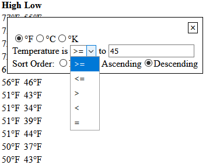

# Defining Custom Controls

Custom [`ColumnControl`][ColumnControl]s can be defined when the [default control][HTMLTableWrapperControl] 
is not a good fit.

Consider a temperature almanac containing readings from various cities around the world:
```html
<!-- ... -->
<h1>Temperature Readings</h1>
<p>Source: <a href="https://weather.com">The Weather Channel</a></p>
<table id="temperatures">
    <thead>
        <th>City</th>
        <th>Date</th>
        <th class="temperature-column">High</th>
        <th class="temperature-column">Low</th>
    </thead>
    <tbody>
        <tr>
            <td>Washington, DC, US</td>
            <td>2020-01-28</td>
            <td class="fahrenheit" data-orig-unit="F" data-orig-temp="47">47</td>
            <td class="fahrenheit" data-orig-unit="F" data-orig-temp="40">40</td>
        </tr>
        <tr>
            <td>Washington, DC, US</td>
            <td>2020-01-27</td>
            <td class="fahrenheit" data-orig-unit="F" data-orig-temp="49">49</td>
            <td class="fahrenheit" data-orig-unit="F" data-orig-temp="36">36</td>
        </tr>
        <tr>
            <td>Washington, DC, US</td>
            <td>2020-01-26</td>
            <td class="fahrenheit" data-orig-unit="F" data-orig-temp="49">49</td>
            <td class="fahrenheit" data-orig-unit="F" data-orig-temp="36">36</td>
        </tr>
        <tr>
            <td>Washington, DC, US</td>
            <td>2020-01-25</td>
            <td class="fahrenheit" data-orig-unit="F" data-orig-temp="51">51</td>
            <td class="fahrenheit" data-orig-unit="F" data-orig-temp="43">43</td>
        </tr>
        <tr>
            <td>Washington, DC, US</td>
            <td>2020-01-24</td>
<!-- ... -->
```

A control specifically tailored to temperatures can make this webpage more useful.

For this example, we'll define a simple control allowing for conversion between Fahrenheit, Celsius, and 
Kelvin with simplistic filtering and sorting options:




## API Explanation

A [`ColumnControl`][ColumnControl] must be implemented to use a custom control with HTMLTableWrapper.js.

A [`ColumnControl`][ColumnControl] is a callback interface used by [`HTMLTableWrapperListener`][HTMLTableWrapperListener]
to control a table column. It must implement the following functions:
- `function` [`open`][ColumnControl-open]: Called when the relevant column header is clicked.
- `function` [`close`][ColumnControl-close]: Called when any other column header is clicked.
- `function` [`getSortDescriptor`][ColumnControl-getSortDescriptor]: Used in [`processTable`][HTMLTableWrapperListener-processTable] 
  to determine how the relevant column is to be sorted.
- `function` [`getFilterDescriptor`][ColumnControl-getFilterDescriptor]: Used in [`processTable`][HTMLTableWrapperListener-processTable] 
  to determine how the relevant column is to be filtered.
- `get `[`columnIndex`][ColumnControl-columnIndex]: zero-based index of the relevant column.

HTMLTableWrapper.js obtains [`ColumnControl`][ColumnControl]s through a [`ColumnControlFactory`][ColumnControlFactory], 
which is a single-function callback interface. It can be given as either a standalone [`function`][HTMLTableWrapperListener~getColumnControl],
or an object that defines a `function` property [`getColumnControl`][ColumnControlFactory-getColumnControl].
In either case, the function must have the following signature:

[`ColumnControl`][ColumnControl]`? (number columnIndex, `[`HTMLTableWrapperListener`][HTMLTableWrapperListener]` parent)`

The function should return a [`ColumnControl`][ColumnControl] handling column `columnIndex`. If no a suitable 
[`ColumnControl`][ColumnControl] can be determined, return [`Nothing`][Nothing], in which case HTMLTableWrapper.js 
will fall back to the [default][HTMLTableWrapperControl] control.

## Notes

This example includes supporting objects/classes that are not directly related to HTMLTableWrapper.js. They
are explained here, but their source files can be consulted for details.
- [`conversions.js`](conversions.js)

   Defines direct temperature-to-temperature conversions, and builds them into a lookup dictionary object.

- <a name="TemperatureConverter"></a>[`TemperatureConverter`](TemperatureConverter.js)

   A helper class exporting a single method: `convertTo(columnIndex, unit)`. As its name implies, it converts 
   the column `columnIndex` of a backing `HTMLTableElement` to the given `unit`. To avoid data loss, conversions 
   are always performed using the `data-orig-temp` and `data-orig-unit` attributes of each cell.

This example also makes use of two helper classes defined in the [_full_][configuration-full] 
HTMLTableWrapper.js library:

- [`ContextControl`][ContextControl]
   
   A class that manages showing, hiding, and positioning contextual dialogs relative to a parent element. 
   It follows a lazy-initialization pattern, dispatching a [`create`][ContextControl_event-create] the first
   time it is [`open`ed][ContextControl-open]. Listeners for this event are expected to populate the control
   with content. The following functions are exported:
   - [`open`][ContextControl-open]: Shows the dialog.
   - [`close`][ContextControl-close]: Hides the dialog.
   - [`position`][ColumnControl-position]: Positions the dialog relative to its parent element.
   - [`getControlElement`][ContextControl-getControlElement]: Returns the backing `HTMLElement`, provided
     the control has been [`open`ed][ContextControl-open] at least once at the time of the call, otherwise `null`.

- [`XMLBuilder`][XMLBuilder]

   A simple, state-based builder for constructing XML strings. It exports the following functions:
   - [`startTag`][XMLBuilder-startTag]: Starts an XML tag.
   - [`attribute`][XMLBuilder-attribute]: Adds an attribute to the current tag (*MUST* be called before [`content`][XMLBuilder-content]).
   - [`content`][XMLBuilder-content]: Defines/adds to the content of the current tag.
   - [`closeTag`][XMLBuilder-closeTag]: Closes the current tag.
   
   All functions return the instance of the [`XMLBuilder`][XMLBuilder] on which they are called, allowing for
   composition:
   ``` javascript
   builder.startTag('parent').attribute('a').attribute('b', 'c')
       .startTag('child').content('abc').closeTag()
       .startTag('child').closeTag()
       .startTag('child').closeTag(true)
   .closeTag().toString();
   
   // =>
   //
   // <parent a b="c">
   //    <child>abc</child>
   //    <child />
   //    <child></child>
   // </parent>
   //
   // (Actual result is NOT formatted.)
   ```

In addition, two more classes defined in the [_utility_][configuration-utility] (and, consequently [_full_][configuration-full]) 
HTMLTableWrapper.js library are used:

- [`SimpleFilterDescriptor`][SimpleFilterDescriptor]

   An implementation of [`FilterDescriptor`][FilterDescriptor] (see [core example][core-example]) handling 
   general-purpose filtering.
  
- [`SimpleFilterDescriptor`][SimpleFilterDescriptor]

   An implementation of [`SortDescriptor`][SortDescriptor] (see [core example][core-example]) handling sorting 
   in ascending and descending order.


## Implementation

The definition of most methods are simple using a [`ContextControl`][ContextControl] and 
[`TemperatureConverter`](#TemperatureConverter):
``` javascript
function TemperatureColumnControl(columnIndex, parent, temperatureConverter) {
    'use strict';
    
    this.columnIndex = columnIndex;                      // Column Index this control handles
    this.parent = parent;                                // Parent HTMLTableWrapperListener
    this.temperatureConverter = temperatureConverter;    // TemperatureConverter
    this.contextControl = new ContextControl();          // Backing ContextControl
}

TemperatureColumnControl.prototype.init = function () {
    'use strict';
    
    this.contextControl.addEventListener('create', this, false);
};

TemperatureColumnControl.prototype.open = function () {
    'use strict';
    
    this.contextControl.open(this.parent.getTableHeaderElement(this.columnIndex));
};

TemperatureColumnControl.prototype.close = function () {
    'use strict';
    
    this.contextControl.close();
};

TemperatureColumnControl.prototype.convertTo = function (unit) {
    'use strict';
    
    this.temperatureConverter.convertColumn(this.columnIndex, unit);
};
```

Building the control's content is also simple using an [`XMLBuilder`][XMLBuilder]. We use a static counter
to generate unique IDs and field names for each instance:
``` javascript
TemperatureColumnControl.idCounter = 0;

TemperatureColumnControl.getIdBase = function () {
    'use strict';
    
    return 'temperatureControl_' + TemperatureColumnControl.idCounter++ + '_';
};

//...

TemperatureColumnControl.prototype.defineContent = function (container) {
    'use strict';
    
    var builder, idBase, fId, cId, kId, unitInputSetName, operatorId, operandId, clickTargets, i,
        sortOrderName, sortOrderNoneId, sortOrderAscId, sortOrderDescId;
    
    builder = new XMLBuilder();
    idBase = TemperatureColumnControl.getIdBase();
    
    // Generate ids.
    fId = idBase + 'fInput';
    cId = idBase + 'cInput';
    kId = idBase + 'kInput';
    operatorId = idBase + 'operator';
    operandId = idBase + 'operand';
    sortOrderNoneId = idBase + 'sortOrderNone';
    sortOrderAscId = idBase + 'sortOrderAsc';
    sortOrderDescId = idBase + 'sortOrderDesc';
    
    // Generate names.
    unitInputSetName = idBase + 'temperatureInput';
    sortOrderName = idBase + 'sortOrder';
    
    // Build content.
    builder.startTag('div').attribute('class', 'control-bar')
        .startTag('span').attribute('class', 'control-button close-button').content('\u00D7').closeTag()
    .closeTag()
    .startTag('div').attribute('class', 'unit-selection')
        .startTag('span')
            .startTag('input').attribute('id', fId).attribute('class', 'temperature-unit')
                    .attribute('name', unitInputSetName).attribute('value', 'F').attribute('type', 'radio')
                    .closeTag()
            .startTag('label').attribute('for', fId).attribute('class', 'fahrenheit').closeTag(true)
        .closeTag()
        .startTag('span')
            .startTag('input').attribute('id', cId).attribute('class', 'temperature-unit')
                    .attribute('name', unitInputSetName).attribute('value', 'C').attribute('type', 'radio')
                    .closeTag()
            .startTag('label').attribute('for', cId).attribute('class', 'celsius').closeTag(true)
        .closeTag()
        .startTag('span')
            .startTag('input').attribute('id', kId).attribute('class', 'temperature-unit')
                    .attribute('name', unitInputSetName).attribute('value', 'K').attribute('type', 'radio')
                    .closeTag()
            .startTag('label').attribute('for', kId).attribute('class', 'kelvin').closeTag(true)
        .closeTag()
    .closeTag()
    .startTag('div').attribute('class', 'filter-condition')
        .startTag('label').attribute('for', operatorId).content('Temperature is ').closeTag()
        .startTag('select').attribute('id', operatorId).attribute('class', 'temperature-filter-operator')
            .startTag('option').attribute('value', '>=').content('>=').closeTag()
            .startTag('option').attribute('value', '<=').content('<=').closeTag()
            .startTag('option').attribute('value', '>').content('>').closeTag()
            .startTag('option').attribute('value', '<').content('<').closeTag()
            .startTag('option').attribute('value', '=').content('=').closeTag()
        .closeTag()
        .startTag('label').attribute('for', operandId).content(' to ').closeTag()
        .startTag('input').attribute('id', operandId).attribute('class', 'temperature-filter-operand')
    .closeTag()
    .startTag('div').attribute('class', 'sort-order')
        .startTag('span').content('Sort Order: ').closeTag()
        .startTag('span').attribute('class', 'field')
            .startTag('input').attribute('id', sortOrderNoneId).attribute('class', 'sort-option')
                    .attribute('name', sortOrderName).attribute('value', 'none').attribute('type', 'radio')
                    .attribute('checked').closeTag()
            .startTag('label').attribute('for', sortOrderNoneId).content('None').closeTag()
        .closeTag()
        .startTag('span').attribute('class', 'field')
            .startTag('input').attribute('id', sortOrderAscId).attribute('class', 'sort-option')
                    .attribute('name', sortOrderName).attribute('value', 'asc').attribute('type', 'radio')
                    .closeTag()
            .startTag('label').attribute('for', sortOrderAscId).content('Ascending').closeTag()
        .closeTag()
        .startTag('span').attribute('class', 'field')
            .startTag('input').attribute('id', sortOrderDescId).attribute('class', 'sort-option')
                    .attribute('name', sortOrderName).attribute('value', 'desc').attribute('type', 'radio')
                    .closeTag()
            .startTag('label').attribute('for', sortOrderDescId).content('Descending').closeTag()
        .closeTag()
    .closeTag();
    
    // Insert content.
    container.insertAdjacentHTML('afterbegin', builder.toString());
    
    // Register for events on newly defined content.
    clickTargets = container.querySelectorAll(TemperatureColumnControl.CLICK_TARGETS_SELECTOR);
    for (i = 0; i < clickTargets.length; ++i) {
        clickTargets[i].addEventListener('click', this, false);
    }
    
    container.querySelector('.temperature-filter-operator').addEventListener('change', this, false);
    container.querySelector('.temperature-filter-operand').addEventListener('keyup', this, false);
};
```

The [`getFilterDescriptor`][ColumnControl-getFilterDescriptor] and [`getSortDescriptor`][ColumnControl-getSortDescriptor]
methods are based on the content defined above:
``` javascript
TemperatureColumnControl.prototype.getFilterDescriptor = function () {
    'use strict';
    
    var controlElement, rawOperand, operand;
    
    controlElement = this.contextControl.getControlElement();
    if (!controlElement) {
        // Control has not been opened yet => no filtering needs to be performed.
        return null;
    }
    
    operand = Number.parseFloat(controlElement.querySelector('.temperature-filter-operand').value);
    if (Number.isNaN(operand)) {
        // Though SimpleFilterDescriptor can handle it, we're opting not to filter if the entered value 
        // is not a number.
        return null;
    }
    
    return new SimpleFilterDescriptor(this.columnIndex, operand, 
            controlElement.querySelector('.temperature-filter-operator').value);
};

TemperatureColumnControl.prototype.getSortDescriptor = function () {
    'use strict';
    
    var controlElement, sortOptions, sortOption, checkedOption, i;
    
    controlElement = this.contextControl.getControlElement();
    if (!controlElement) {
        // Control has not been opened yet => no sorting needs to be performed.
        return null;
    }
    
    // Find first checked sort option.
    sortOptions = controlElement.getElementsByClassName('sort-option');
    for (i = 0; i < sortOptions.length; ++i) {
        sortOption = sortOptions[i];
        if (sortOption.checked) {
            checkedOption = sortOption;
            break;
        }
    }
    
    // If no option is selected OR the 'none' option is selected, no sorting should be performed.
    if (!checkedOption || checkedOption.value === 'none') {
        return null;
    }
    
    return new SimpleSortDescriptor(this.columnIndex, checkedOption.value === 'desc');
};
```

We wire everything together in the `handleEvent` function. We also define the `updateParent` helper
function to reposition the control after the parent table has been processed. This is because it's common
for column widths to change after filtering auto-sized tables:
``` javascript
TemperatureColumnControl.prototype.handleEvent = function (event) {
    'use strict';
    
    var target;
    
    target = event.target;
    
    switch (event.type) {
        // First time control is opened.
        case 'create':
            this.defineContent(target.getControlElement());
            break;
            
        case 'click':
            if (target.classList.contains('temperature-unit')) {     // Unit change.
                this.convertTo(target.value);
            } else if (target.classList.contains('close-button')) {  // Close button.
                this.close();
            } else if (target.classList.contains('sort-option')) {   // Sort option.
                this.updateParent();
            }
            break;
            
        // Filter operator or operand change.
        case 'change':
        case 'keyup':
            this.updateParent();
            break;
    }
};

TemperatureColumnControl.prototype.updateParent = function () {
    'use strict';
    
    this.parent.processTable();
    this.contextControl.position();
};
```


Because we use a common [`TemperatureConverter`](#TemperatureConverter), we opt to define an object-based
[`ColumnControlFactory`][ColumnControlFactory]:
``` javascript
function TemperatureColumnControlFactory(temperatureConverter) {
    'use strict';
    
    this.temperatureConverter = temperatureConverter;
}

TemperatureColumnControlFactory.prototype.getColumnControl = function (columnIndex, parent) {
    'use strict';
    
    if (parent.getTableHeaderElement(columnIndex).classList.contains('temperature-column')) {
        return new TemperatureColumnControl(columnIndex, parent, this.temperatureConverter);
    }
    
    // Not strictly necessary; no return statement implies a return value of undefined.
    return null;
};
```


The page initialization scripts look like this:
``` html
<link rel="stylesheet" href="https://cdn.jsdelivr.net/npm/html-table-wrapper/html-table-wrapper.min.css" />
<script src="https://cdn.jsdelivr.net/npm/html-table-wrapper/html-table-wrapper.min.js"></script>

<script src="TemperatureConverter.js"></script>
<script src="TemperatureColumnControl.js"></script>
<script src="TemperatureColumnControlFactory.js"></script>
<script>

document.addEventListener('DOMContentLoaded', function () {
    'use strict';
    
    var table;
    
    table = document.getElementById('temperatures');
    
    new HTMLTableWrapperListener(table, new TemperatureColumnControlFactory(
            new TemperatureConverter(table, temperatureDescriptions))).init();
});

</script>
```

The working webpage can be found [here](https://mschlege1838.github.io/html-table-wrapper/examples/temperatures/temperatures.html).


[ColumnControlFactory]: https://mschlege1838.github.io/html-table-wrapper/ColumnControlFactory.html
[ColumnControl]: https://mschlege1838.github.io/html-table-wrapper/ColumnControl.html
[ColumnControl-open]: https://mschlege1838.github.io/html-table-wrapper/ColumnControl.html#open
[ColumnControl-close]: https://mschlege1838.github.io/html-table-wrapper/ColumnControl.html#close
[ColumnControl-getSortDescriptor]: https://mschlege1838.github.io/html-table-wrapper/ColumnControl.html#getSortDescriptor
[ColumnControl-getFilterDescriptor]: https://mschlege1838.github.io/html-table-wrapper/ColumnControl.html#getFilterDescriptor
[ColumnControl-position]: https://mschlege1838.github.io/html-table-wrapper/ColumnControl.html#position
[ColumnControl-columnIndex]: https://mschlege1838.github.io/html-table-wrapper/ColumnControl.html#columnIndex
[HTMLTableWrapperListener]: https://mschlege1838.github.io/html-table-wrapper/HTMLTableWrapperListener.html
[HTMLTableWrapperListener-processTable]: https://mschlege1838.github.io/html-table-wrapper/HTMLTableWrapperListener.html#processTable
[HTMLTableWrapperListener~getColumnControl]: https://mschlege1838.github.io/html-table-wrapper/HTMLTableWrapperListener.html#~getColumnControl
[HTMLTableWrapperControl]: https://mschlege1838.github.io/html-table-wrapper/HTMLTableWrapperControl.html
[ContextControl]: https://mschlege1838.github.io/html-table-wrapper/ContextControl.html
[ContextControl-open]: https://mschlege1838.github.io/html-table-wrapper/ContextControl.html#open
[ContextControl-close]: https://mschlege1838.github.io/html-table-wrapper/ContextControl.html#close
[ContextControl-addEventListener]: https://mschlege1838.github.io/html-table-wrapper/ContextControl.html#addEventListener
[ContextControl_event-create]: https://mschlege1838.github.io/html-table-wrapper/ContextControl.html#event:event:create
[ContextControl-getControlElement]: https://mschlege1838.github.io/html-table-wrapper/ContextControl.html#getControlElement
[XMLBuilder]: https://mschlege1838.github.io/html-table-wrapper/XMLBuilder.html
[XMLBuilder-startTag]: https://mschlege1838.github.io/html-table-wrapper/XMLBuilder.html#startTag
[XMLBuilder-attribute]: https://mschlege1838.github.io/html-table-wrapper/XMLBuilder.html#attribute
[XMLBuilder-content]: https://mschlege1838.github.io/html-table-wrapper/XMLBuilder.html#content
[XMLBuilder-closeTag]: https://mschlege1838.github.io/html-table-wrapper/XMLBuilder.html#closeTag
[ColumnControlFactory]: https://mschlege1838.github.io/html-table-wrapper/ColumnControlFactory.html
[ColumnControlFactory-getColumnControl]: https://mschlege1838.github.io/html-table-wrapper/ColumnControlFactory.html#getColumnControl
[SimpleFilterDescriptor]: https://mschlege1838.github.io/html-table-wrapper/SimpleFilterDescriptor.html
[FilterDescriptor]: https://mschlege1838.github.io/html-table-wrapper/FilterDescriptor.html
[SimpleSortDescriptor]: https://mschlege1838.github.io/html-table-wrapper/SimpleSortDescriptor.html
[SortDescriptor]: https://mschlege1838.github.io/html-table-wrapper/SortDescriptor.html
[Nothing]: https://mschlege1838.github.io/html-table-wrapper/Nothing.html

[configuration-full]: https://github.com/mschlege1838/html-table-wrapper#configurationFull
[configuration-utility]: https://github.com/mschlege1838/html-table-wrapper#configurationUtility
[core-example]: https://mschlege1838.github.io/html-table-wrapper/examples/temperatures-custom/temperatures-custom.html
